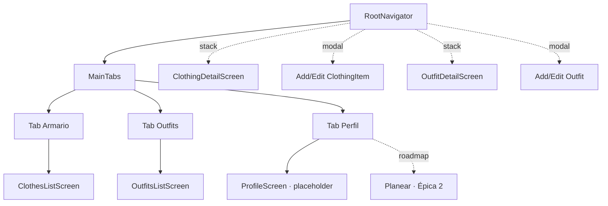
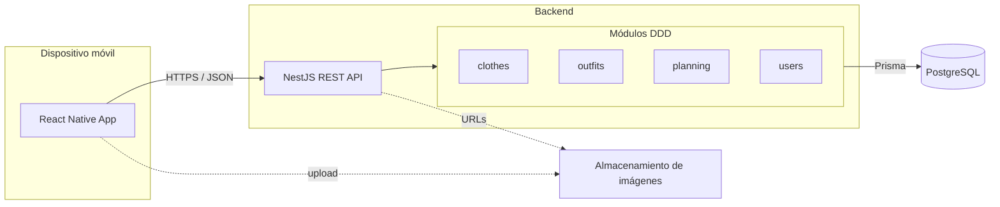
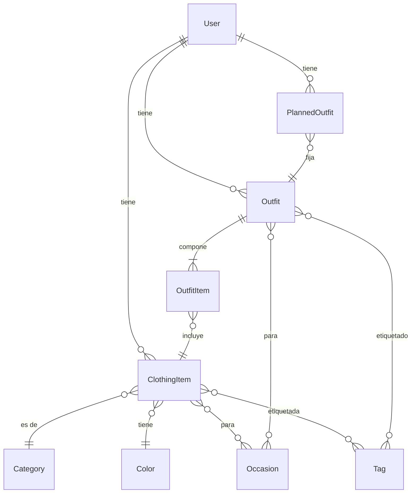

# Ready — Alistá tus outfits

> Proyecto final de **AI4Devs** (LIDR Academy). App móvil para **preparar con
> antelación la ropa que vas a usar**: armás un armario digital, combinás prendas en
> outfits reutilizables y dejás listo el outfit de tu próxima salida.

Este README es el **entregable 1 (documentación)**. La documentación ampliada y
modular vive en [`docs/`](docs/) (01–09). La evidencia de uso de IA está en
[`prompts.md`](prompts.md).

---

## Índice

0. [Ficha del proyecto](#0-ficha-del-proyecto)
1. [Descripción general del producto](#1-descripción-general-del-producto)
2. [Arquitectura del sistema](#2-arquitectura-del-sistema)
3. [Modelo de datos](#3-modelo-de-datos)
4. [Especificación de la API](#4-especificación-de-la-api)
5. [Historias de usuario](#5-historias-de-usuario)
6. [Tickets de trabajo](#6-tickets-de-trabajo)
7. [Pull requests](#7-pull-requests)

---

## 0. Ficha del proyecto

### **0.1. Tu nombre completo:**

Daniel Torres (`danielmao`)

### **0.2. Nombre del proyecto:**

Ready — app para alistar outfits.

### **0.3. Descripción breve del proyecto:**

App móvil + API backend para **preparar con antelación la ropa que vas a usar**. El
usuario digitaliza su armario, combina prendas en outfits reutilizables y deja fijado
el **próximo outfit** para revisarlo de un vistazo antes de salir. Proyecto final de
AI4Devs (LIDR Academy); stack **React Native + NestJS + PostgreSQL/Prisma**.

### **0.4. URL del proyecto:**

Sin URL pública aún (MVP en desarrollo local; ver [§1.4](#14-instrucciones-de-instalación)).

### 0.5. URL o archivo comprimido del repositorio

https://github.com/danielmao/ready

### **Alcance del MVP (decisiones cerradas)**

| Decisión | Resolución para el MVP |
|----------|------------------------|
| **Planning** | Un único **"próximo outfit" activo** por usuario (no calendario). |
| **Sugerencias por clima/ocasión** | **Fuera del MVP** → roadmap (Épica 2/3). |
| **Autenticación** | **Diferida** → backend single-user con `userId` fijo. |
| **Base de datos** | **PostgreSQL + Prisma**. |

> El diseño deja explícitamente **puertas abiertas** (calendario, historial, ratings,
> sugerencias con IA, auth multi-usuario) sin condicionar la arquitectura del MVP.
> Ver [§1.2](#12-características-y-funcionalidades-principales) y [`docs/01-PROJECT-OVERVIEW.md`](docs/01-PROJECT-OVERVIEW.md).

---

## 1. Descripción general del producto

### **1.1. Objetivo:**

**Ready resuelve la fricción de vestirse a las apuras.** En vez de improvisar cada
mañana frente al ropero, el usuario:

1. **Digitaliza su armario** — registra cada prenda con foto, categoría, color y ocasiones.
2. **Arma outfits reutilizables** — combina ≥2 prendas en conjuntos con nombre.
3. **Deja listo el próximo outfit** — selecciona qué se va a poner en su próxima salida
   y lo revisa de un vistazo antes de salir.

**Para quién:** cualquier persona que quiera organizar su ropa y ahorrar tiempo/decisión
al vestirse. El MVP es de **uso personal** (un solo usuario por dispositivo).

**Valor diferencial:** simplicidad. No es una app de compras ni un asistente de IA
pesado; es un organizador rápido centrado en el acto de *alistar* el outfit.

### **1.2. Características y funcionalidades principales:**

#### Core del MVP (imprescindible)

| Funcionalidad | Descripción |
|---------------|-------------|
| Registrar prendas | Crear `ClothingItem` con nombre, categoría, color, ocasiones, tags y fotos. |
| Listar / filtrar prendas | Catálogo con filtro por categoría, color y ocasión. |
| Detalle de prenda | Fotos, datos completos y outfits que la usan. |
| Editar / archivar prenda | Modificar campos o marcar inactiva (sin borrado físico). |
| Crear outfits | Combinar ≥2 prendas (`OutfitItem`), con nombre, ocasiones y tags. |
| Listar / filtrar outfits | Catálogo con filtro por ocasión, tags y prendas incluidas. |
| Detalle de outfit | Preview del conjunto, lista de prendas y acción "planear". |
| Editar / archivar outfit | Cambiar datos, añadir/quitar prendas, archivar. |
| Planear próximo outfit | Fijar **un** outfit como el próximo (`PlannedOutfit` activo). |
| Ver outfit planeado | Vista del outfit listo + checklist de prendas antes de salir. |
| Cambiar outfit planeado | Reemplazar el outfit activo (el anterior se cancela). |

#### Importantes pero no bloqueantes (MVP si alcanza el tiempo)

- Búsqueda avanzada de prendas y outfits.
- Tags dinámicos creados por el usuario.
- Ocasiones propias (además del catálogo predefinido).
- Múltiples fotos por prenda.
- Filtros combinados.

#### Roadmap — puertas abiertas (NO en v1)

| Funcionalidad | Épica |
|---------------|-------|
| Calendario de outfits por fecha (vista semanal/mensual) | Épica 2 |
| Historial de outfits usados (`OutfitHistory`) | Épica 2 |
| Calificación de outfits (`OutfitRating`) | Épica 2 |
| Recordatorios / notificaciones | Épica 2 |
| Sugerencias por ocasión | Épica 2 |
| Sugerencias con IA y por clima (API externa) | Épica 3 |
| Login con Google (multi-usuario, sync) | Épica 1 (post-MVP) |

> El **modelo de datos del MVP ya contempla estas extensiones** (campos opcionales,
> entidades futuras documentadas) para no requerir migraciones disruptivas.

### **1.3. Diseño y experiencia de usuario:**

La app se organiza en **3 tabs** (bottom tabs) — **Armario · Outfits · Perfil**, según el diseño
aprobado (Claude Design `Ready.dc`). Los detalles/altas/ediciones se apilan en el stack raíz
sobre los tabs. *(El tab **Planear** y los stacks de Settings/Search son roadmap — Épica 2.)*



**Flujos principales:**

| Flujo | Pantallas |
|-------|-----------|
| Crear prenda | ClothesList → *AddClothingItem (modal)* → vuelve a la lista |
| Crear outfit | OutfitsList → *AddOutfit (modal)* → vuelve a la lista |
| Ver detalle | ClothesList/OutfitsList → Detail → *Edit (modal)* |
| Planear outfit *(roadmap)* | PlannedOutfit → *SelectOutfitForPlanning* → TodayOutfitPreview |

Detalle de cada pantalla (propósito, componentes, datos que consume/modifica) en
[`docs/05-FRONTEND-INTEGRATION.md`](docs/05-FRONTEND-INTEGRATION.md).

### **1.4. Instrucciones de instalación:**

Requisitos: Node 20+, Docker (Postgres), y entorno React Native (Expo o RN CLI).

```bash
# 1. Clonar
git clone git@github-dnl:danielmao/ready.git && cd ready

# 2. Backend
cd apps/backend
cp .env.example .env            # configurar DATABASE_URL
docker compose up -d postgres   # levantar Postgres local
npm install
npx prisma migrate dev          # crear esquema
npm run seed                    # catálogos (categorías, colores, ocasiones) + user fijo
npm run start:dev               # API en http://localhost:3000

# 3. Mobile (en otra terminal)
cd ../mobile
npm install
npm run start                   # Metro / Expo
```

Guía detallada (variables de entorno, troubleshooting, seeds): [`docs/08-INSTALLATION-GUIDE.md`](docs/08-INSTALLATION-GUIDE.md).

---

## 2. Arquitectura del Sistema

### **2.1. Diagrama de arquitectura:**



**Patrón:** cliente móvil (RN) ↔ API REST (NestJS) ↔ PostgreSQL (Prisma). Arquitectura
**monolito modular** organizado por **bounded context**, cada uno con tres capas
(`domain` / `application` / `infrastructure`) y la regla de dependencias
`infra → application → domain`. Los dominios se comunican **solo vía facade**. MVP
single-user: el backend asume un `userId` fijo inyectado por un guard/decorator; cuando
se incorpore auth (Épica 1), ese guard pasa a resolver el usuario desde el JWT sin tocar
los casos de uso.

**Por qué esta arquitectura:** permite testear el dominio sin framework ni base de datos,
aísla Prisma en una sola capa (cambiar de ORM no toca la lógica) y hace explícitos los
límites entre módulos. **Sacrificio:** más boilerplate por dominio (contratos + tokens de
DI + mappers) que un CRUD plano; se asume a cambio de mantenibilidad y de poder crecer a
los módulos del roadmap sin refactors disruptivos.

### **2.2. Descripción de componentes principales:**

| Componente | Responsabilidad | Tecnología |
|------------|-----------------|------------|
| **Mobile app** | UI, navegación, estado local, llamadas a la API | React Native + TS, Expo (salvo bare RN), NativeWind (estilos), React Navigation / Expo Router, React Query, React Hook Form + Zod |
| **infrastructure** | Entrada HTTP (controllers), impl Prisma de los contratos, wiring de Nest | NestJS, Prisma |
| **application** | Casos de uso (`execute()`), services internos, **facades** (API entre dominios), contratos de repositorio + token de DI | NestJS (DI) |
| **domain** | Entidades planas, enums, invariantes de negocio | TS puro (sin framework) |
| **Persistencia** | Esquema relacional, migraciones, queries | PostgreSQL + Prisma |
| **Imágenes** | Almacenar fotos de prendas | Filesystem local (MVP) → S3-compatible (futuro) |

### **2.3. Descripción de alto nivel del proyecto y estructura de ficheros**

Monorepo **"apps/ simple"** (sin tooling de monorepo extra):

```
ready/
├── README.md                 # este entregable
├── prompts.md                # evidencia de IA
├── docs/                     # documentación modular 01–09
└── apps/
    ├── mobile/               # React Native
    │   └── src/{screens,components,features,navigation,services,hooks,state,domain,utils}
    └── backend/              # NestJS + DDD por capas
        ├── prisma/           # schema.prisma (recurso compartido)
        └── src/
            ├── shared/{prisma,auth,types}            # infra transversal
            └── {clothes,outfits,planning,users}/
                  domain/{entities,enums,utils}
                  application/{repositories,use-cases,services,facades,dtos}
                  infrastructure/{controllers,persistence/repositories,*.module.ts}
```

Árbol completo de front y back en [`docs/02-ARCHITECTURE.md`](docs/02-ARCHITECTURE.md).

### **2.4. Infraestructura y despliegue**

- **MVP / desarrollo:** todo local. Postgres en Docker; API con `npm run start:dev`;
  app con Metro/Expo.
- **Imágenes:** se guardan en filesystem y se sirven por URL estática. Migrable a un
  bucket S3-compatible sin cambiar el contrato de la API (sólo cambia la `imageUrl`).
- **Despliegue futuro:** backend containerizado (Docker) + Postgres gestionado; app
  distribuida vía Expo/EAS o stores. Fuera del alcance del entregable 1.
- **Enforcement de arquitectura:** `dependency-cruiser` (`npm run lint:arch`) hace cumplir
  los boundaries de capas/facades en CI; un hook de pre-commit detecta drift entre el
  código y la documentación de arquitectura.

### **2.5. Seguridad**

| Aspecto | MVP | Futuro |
|---------|-----|--------|
| Autenticación | `userId` fijo (single-user) | Google OAuth + JWT |
| Autorización | Scope implícito al único usuario | Guards por `userId` del token |
| Validación de entrada | DTOs con `class-validator` en todos los endpoints | igual |
| Datos sensibles | No se almacenan credenciales en el MVP | Hash/secret management |

Detalle y plan de testing de seguridad en [`docs/09-SECURITY-TESTING.md`](docs/09-SECURITY-TESTING.md).

### **2.6. Tests**

| Capa | Estrategia | Herramientas |
|------|-----------|--------------|
| Backend — unit | Casos de uso y reglas de dominio (mín. 2 prendas por outfit, 1 planned activo) | Jest |
| Backend — e2e | Flujos HTTP por módulo (crear prenda, crear outfit, planear) | Jest + Supertest |
| Mobile — unit | Componentes y hooks clave | Jest + React Native Testing Library |

Plan completo en [`docs/09-SECURITY-TESTING.md`](docs/09-SECURITY-TESTING.md).

---

## 3. Modelo de Datos

### **3.1. Diagrama del modelo de datos:**

Diagrama entidad-relación del **MVP** (entidades futuras marcadas como roadmap):



### **3.2. Descripción de entidades principales:**

| Entidad | Propósito | Campos clave | Reglas de negocio |
|---------|-----------|--------------|-------------------|
| **User** | Usuario (único en MVP) | id, email, name, photoUrl?, createdAt | Único; en MVP se siembra un registro fijo. |
| **ClothingItem** | Prenda | id, userId, name, categoryId, colorId, description?, imageUrls[], isActive | name obligatorio; categoría y color obligatorios; archivado lógico (`isActive`). |
| **Category** | Tipo de prenda (catálogo) | id, name, icon?, parentCategoryId? | Predefinido; jerarquía opcional. |
| **Color** | Color (catálogo) | id, name, hexCode | Predefinido; hexCode obligatorio. |
| **Tag** | Etiqueta flexible | id, name, userId? | Creada por el usuario; reutilizable. |
| **Occasion** | Contexto de uso | id, name, icon?, isGlobal | Catálogo global + propias del usuario. |
| **Outfit** | Conjunto de prendas | id, userId, name, isActive | name obligatorio; **mín. 2 OutfitItem**; archivado lógico. |
| **OutfitItem** | Relación outfit↔prenda | id, outfitId, clothingItemId, order | Única (outfitId, clothingItemId); `order` para orden visual. |
| **PlannedOutfit** | Próximo outfit listo | id, userId, outfitId, plannedFor?, status | **1 sólo activo** (`status=planned`) por usuario; al crear uno nuevo, el anterior pasa a `cancelled`. |

**Entidades futuras (documentadas, no implementadas):** `OutfitHistory`, `OutfitRating`.
El campo `PlannedOutfit.plannedFor` (fecha opcional) es el punto de extensión hacia el
**calendario** de la Épica 2.

Esquema Prisma, tablas pivote N:M y catálogos semilla en
[`docs/03-DATA-MODEL.md`](docs/03-DATA-MODEL.md).

---

## 4. Especificación de la API

API REST bajo `/api`. MVP sin auth (single-user). Formato JSON. Paginación por
`page`/`limit` en listados.

### **Clothes**

| Método | Ruta | Propósito |
|--------|------|-----------|
| GET | `/api/clothes` | Listar prendas (filtros: categoryId, colorId, occasionId, tagId, search) |
| GET | `/api/clothes/:id` | Detalle de prenda |
| POST | `/api/clothes` | Crear prenda |
| PUT | `/api/clothes/:id` | Actualizar prenda |
| DELETE | `/api/clothes/:id` | Archivar prenda |
| GET | `/api/clothes/categories` | Catálogo de categorías |
| GET | `/api/clothes/colors` | Catálogo de colores |
| GET / POST | `/api/clothes/tags` | Listar / crear tags |
| GET / POST | `/api/clothes/occasions` | Listar / crear ocasiones |

### **Outfits**

| Método | Ruta | Propósito |
|--------|------|-----------|
| GET | `/api/outfits` | Listar outfits (filtros: occasionId, tagId, clothingId, search) |
| GET | `/api/outfits/:id` | Detalle con items |
| POST | `/api/outfits` | Crear outfit (≥2 items) |
| PUT | `/api/outfits/:id` | Actualizar outfit |
| DELETE | `/api/outfits/:id` | Archivar outfit |
| POST | `/api/outfits/:id/items` | Añadir prenda |
| DELETE | `/api/outfits/:id/items/:itemId` | Quitar prenda |

### **Planning**

| Método | Ruta | Propósito |
|--------|------|-----------|
| GET | `/api/planning` | Obtener el outfit planeado activo |
| POST | `/api/planning` | Fijar un outfit como próximo (cancela el anterior) |
| PUT | `/api/planning` | Actualizar el planeado activo |
| PUT | `/api/planning/confirm` | Confirmar (el usuario sale con el outfit) |
| DELETE | `/api/planning` | Quitar el outfit planeado |

Esquemas de request/response, códigos de error y fragmentos OpenAPI en
[`docs/04-API-SPECIFICATION.md`](docs/04-API-SPECIFICATION.md).

---

## 5. Historias de Usuario

Listado priorizado (formato completo con criterios de aceptación en
[`docs/06-USER-STORIES.md`](docs/06-USER-STORIES.md)).

### **Historia de Usuario 1: Registrar una prenda**

> Como usuario quiero registrar una prenda con foto, categoría y color para tener mi
> armario digitalizado.

**Criterios de aceptación:**
- name, categoría y color son obligatorios.
- se pueden adjuntar 0 o más fotos.
- al guardar, la prenda aparece en el listado del armario.

### **Historia de Usuario 2: Crear un outfit**

> Como usuario quiero combinar ≥2 prendas en un outfit con nombre para reutilizarlo.

**Criterios de aceptación:**
- el outfit requiere un mínimo de 2 prendas.
- no se puede repetir la misma prenda dentro del mismo outfit.
- al guardar, el outfit aparece en el listado y puede planearse.

### **Historia de Usuario 3: Planear el próximo outfit**

> Como usuario quiero fijar un outfit como "el próximo" para tenerlo listo al salir,
> y revisarlo con un checklist de prendas antes de salir.

**Criterios de aceptación:**
- sólo existe un `PlannedOutfit` activo por usuario.
- al fijar otro, el anterior pasa a `cancelled`.
- la vista del planeado muestra el checklist de prendas del outfit.

### **Otras historias (priorización)**

| ID | Título | Prioridad |
|----|--------|-----------|
| HU-02 | Ver y filtrar mi armario | Core |
| HU-06 | Editar / archivar prendas y outfits | Importante |
| HU-07 | Buscar prendas y outfits | Importante |
| HU-08 | Etiquetas y ocasiones propias | Importante |

---

## 6. Tickets de Trabajo

Backlog completo en [`docs/07-WORK-TICKETS.md`](docs/07-WORK-TICKETS.md). Selección
representativa:

| ID | Tipo | Título | HU | Estimación |
|----|------|--------|----|-----------:|
| RDY-1 | Infra | Scaffolding backend NestJS + Prisma + Docker Postgres | — | M |
| RDY-2 | Infra | Scaffolding mobile RN + navegación (tabs/stacks/modales) | — | M |
| RDY-3 | Backend | Módulo `clothes`: CRUD + catálogos | HU-01,02,08 | L |
| RDY-4 | Backend | Módulo `outfits`: CRUD + items (regla ≥2 prendas) | HU-03,06 | L |
| RDY-5 | Backend | Módulo `planning`: 1 activo, confirm, cancel | HU-04,05 | M |
| RDY-6 | Mobile | Tab Prendas: lista + filtros + detalle + alta (modal) | HU-01,02 | L |
| RDY-9 | QA | Tests unit (dominio) + e2e (flujos HTTP) | — | M |

Tres tickets detallados (backend, frontend y base de datos):

### **Ticket 1 (Backend): Módulo `clothes` — CRUD + catálogos**

#### Descripción:
Implementar el bounded context `clothes` con la convención DDD por capas: dominio,
casos de uso, contratos de repositorio y persistencia Prisma. Expone el CRUD de prendas
y los catálogos asociados (categorías, colores, tags, ocasiones).

#### Requisitos funcionales:
- CRUD de `ClothingItem` (crear, listar con filtros, detalle, actualizar, archivar).
- Endpoints de catálogo: categorías, colores, tags (GET/POST), ocasiones (GET/POST).
- Archivado lógico (`isActive`), nunca borrado físico.

#### Requisitos técnicos:
- Tres capas (`domain`/`application`/`infrastructure`); cruce a otros dominios sólo vía facade.
- Prisma confinado a `infrastructure/persistence`; contratos inyectados por token de DI.
- DTOs validados con `class-validator`.

#### Criterios de aceptación:
- name/categoría/color obligatorios; rechazo con 400 si faltan.
- `npm run lint:arch` pasa (sin violaciones de capas/facades).
- Tests unit del dominio + e2e del flujo de creación en verde.

### **Ticket 2 (Frontend): Tab Prendas — lista, filtros, detalle y alta**

#### Descripción:
Construir el Tab "Prendas" en React Native: catálogo con filtros, detalle de prenda y
alta vía modal, consumiendo la API de `clothes`.

#### Requisitos funcionales:
- `ClothesListScreen` con filtro por categoría/color/ocasión y búsqueda.
- `ClothingDetailScreen` con fotos, datos y outfits relacionados.
- `CreateClothingScreen` (modal) con upload de fotos y selectores de catálogo.

#### Requisitos técnicos:
- React Navigation (tab + stack + modal); React Query para data fetching/caché.
- Formulario con React Hook Form + Zod; `react-native-image-picker` para fotos.

#### Criterios de aceptación:
- crear una prenda la deja visible en la lista sin recargar manualmente.
- los filtros refinan el listado en cliente/servidor sin recargar la pantalla.
- tests de componentes/hooks clave en verde (Jest + RN Testing Library).

### **Ticket 3 (Base de datos): Esquema Prisma, migraciones y seeds**

#### Descripción:
Definir el `schema.prisma` del MVP (entidades y pivotes N:M), generar la migración
inicial y sembrar catálogos + el usuario fijo single-user.

#### Requisitos funcionales:
- Modelos: User, ClothingItem, Category, Color, Tag, Occasion, Outfit, OutfitItem, PlannedOutfit.
- Pivotes N:M para prenda↔ocasión, prenda↔tag, outfit↔ocasión, outfit↔tag.
- Seed de categorías, colores, ocasiones globales y el `User` fijo del MVP.

#### Requisitos técnicos:
- `PlannedOutfit.plannedFor` opcional (punto de extensión al calendario, Épica 2).
- Restricción única `(outfitId, clothingItemId)` en `OutfitItem`.
- Archivado lógico (`isActive`) en `ClothingItem` y `Outfit`.

#### Criterios de aceptación:
- `npx prisma migrate dev` crea el esquema desde cero sin errores.
- `npm run seed` deja catálogos + user fijo listos para usar la API.
- el modelo soporta la regla "1 PlannedOutfit activo por usuario".

---

## 7. Pull Requests

Los PRs se documentarán a medida que avance la implementación (fase posterior al
entregable 1). Convención del repo:

- Una rama por ticket (`feat/RDY-3-clothes-module`).
- PR con descripción enlazando el ticket y las HU que cierra.
- Checklist de tests + `npm run lint:arch` antes de merge.

### **Pull Request 1: _(pendiente)_**

Se completará al implementar el primer módulo del backend.

### **Pull Request 2: _(pendiente)_**

Se completará al implementar el primer Tab del frontend.

### **Pull Request 3: _(pendiente)_**

Se completará con el esquema de base de datos y los seeds.

---

> **Evidencia de uso de IA:** ver [`prompts.md`](prompts.md). Los prompts crudos se
> graban con `/save-prompt` en `prompts/_inbox/` y se curan con `/curate-prompts`.
