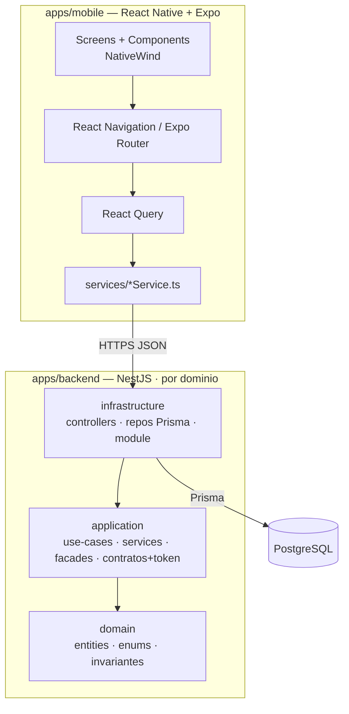
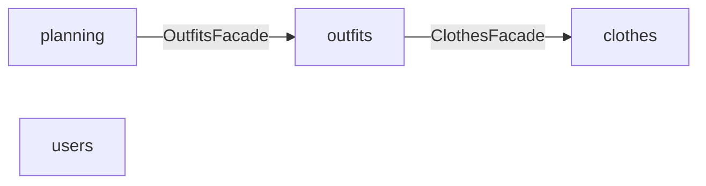

# 02 · Arquitectura del sistema

> Expansión de la sección 2 del [README](../README.md).

## 1. Vista general

Monolito modular: app **React Native** ↔ **API NestJS** ↔ **PostgreSQL (Prisma)**.
El backend se organiza por **bounded context** (dominio) y, dentro de cada uno, en
**tres capas físicas** con una regla de dependencias estricta:
`infrastructure → application → domain`. Las flechas apuntan **hacia adentro**:
`domain` no conoce a nadie; `application` no conoce `infrastructure`.

- **domain** — el modelo de negocio puro: entidades (clases planas), enums e invariantes.
  No sabe nada de NestJS, Prisma ni transporte.
- **application** — casos de uso y lógica de aplicación. Define **contratos** (interfaces
  de repositorio + token de inyección) de todo lo externo que necesita, sin conocer su
  implementación. Contiene `use-cases` (un `execute()` por caso), `services` internos,
  `facades` (la API pública del dominio) y `dtos`.
- **infrastructure** — los detalles técnicos. Implementa los contratos de `application`
  (Prisma, HTTP, clientes de terceros) y hace el wiring de Nest. Aquí viven los
  `controllers` y los repositorios Prisma (único lugar donde se mapea modelo Prisma ↔
  entidad de dominio).

La comunicación entre dominios ocurre **siempre a través de la facade** del otro dominio;
ningún dominio importa repos/services/use-cases ajenos ni accede a tablas de otro dominio.



> Regla de oro: las flechas apuntan hacia adentro. `domain` es el centro y no importa de
> ninguna otra capa; `application` nunca importa de `infrastructure` ni del cliente de Prisma.

## 2. Decisiones de arquitectura (ADR resumidos)

| Decisión | Elección | Razón |
|----------|----------|-------|
| Workspace | Monorepo "apps/ simple" | Front y back juntos sin tooling extra; un solo repo del proyecto final. |
| Backend framework | NestJS + DDD por capas | Estructura clara por dominio; alineado con experiencia del autor. |
| Capas por dominio | `domain` / `application` / `infrastructure` | Regla `infra → application → domain`; dominio puro y testeable, infra reemplazable. |
| Acoplamiento entre módulos | Solo vía **facade** del otro dominio | Boundary explícito; evita acceso directo a repos/tablas ajenas. |
| Inyección de dependencias | Contra contratos vía token (`@Inject(SYMBOL)`) | El dominio depende de interfaces, no de clases concretas de infra. |
| ORM / DB | Prisma + PostgreSQL | Dominio relacional (N:M tags/ocasiones, OutfitItem); migraciones y tipado fuertes. |
| Single-user en MVP | `userId` fijo vía guard | Evita el costo de auth sin condicionar el modelo (todas las entidades ya tienen `userId`). |
| Planning = 1 activo | Estado `planned/confirmed/cancelled` | Fiel al producto "próximo outfit"; `plannedFor` deja abierto el calendario. |
| Imágenes | ~~Filesystem local (MVP)~~ → **S3 (MinIO en local)** | Reemplaza el filesystem: la subida real de fotos usa object storage (AWS S3 en prod, MinIO S3-compatible en dev vía `compose.dev.yaml`), nunca disco del servidor. Un **puerto** `ImageStorageService` (token `IMAGE_STORAGE`) vive en `application/storage/` y el **adapter** `S3ImageStorageService` (`@aws-sdk/client-s3`) en `infrastructure/storage/`. El **bucket es privado**: la API lee los objetos con credenciales y los sirve por `GET /api/clothes/images/:key`; el host de storage nunca se expone. El contrato API sigue exponiendo sólo URLs. Ver `docs/specs/active/clothes-image-upload.md`. |
| Logging | **`nestjs-pino` (structured)** | Logs estructurados (objeto-primero) con IDs de dominio; integración nativa con Nest. Reglas en `CODING-CONVENTIONS.md §3`. |
| Despliegue (MVP) | **EC2 + Docker Compose** (`api` + Caddy), deploy manual | Lo más barato/simple para un MVP; Caddy da HTTPS automático (Let's Encrypt) sin ALB. CI/CD y S3 quedan para después del core. Ver `docs/specs/active/backend-first-deploy-health.md`. |
| DB en el deploy MVP | **Postgres en el mismo EC2** (contenedor en el compose, volumen persistente), **no** RDS | Cero costo extra y un solo host para el MVP; la DB no se expone a internet (sólo la ve `api`). La API migra/siembra al arrancar (`docker-entrypoint.sh`). Migrar a **RDS + backups** cuando el core (`clothes → outfits → planning`) crezca. |
| Imagen del backend (base) | **`node:20-slim`** (Debian), no Alpine | Prisma necesita openssl/engines; en Alpine (musl) el engine se intenta descargar en runtime y falla. Slim trae los engines correctos horneados en el build. |

## 3. Estructura de ficheros — backend

Bounded contexts: **`clothes`** (`ClothingItem` + catálogos `Category`, `Color`, `Tag`,
`Occasion`), **`outfits`** (`Outfit`, `OutfitItem`), **`planning`** (`PlannedOutfit`) y
**`users`** (`User`, single-user en MVP).

```
apps/backend/
├── prisma/
│   └── schema.prisma             # recurso compartido de infra (fuera de los dominios)
└── src/
    ├── main.ts
    ├── app.module.ts             # importa PrismaModule + los 4 módulos de dominio
    ├── shared/                   # infra transversal (sin lógica de negocio)
    │   ├── prisma/               # PrismaService + PrismaModule (@Global)
    │   ├── auth/                 # @CurrentUser() + CurrentUserGuard (userId fijo en MVP)
    │   └── types/                # contratos compartidos (p. ej. Paginated<T>)
    └── {domain}/                 # clothes · outfits · planning · users
        ├── domain/
        │   ├── entities/         # clases planas; sin framework ni Prisma
        │   ├── enums/
        │   └── utils/            # invariantes puras (ej. outfit ≥2 prendas)
        ├── application/
        │   ├── repositories/     # SOLO interfaces (contratos) + token SYMBOL
        │   ├── use-cases/        # un caso de uso = una clase con un único execute()
        │   ├── services/         # lógica reutilizable interna del dominio
        │   ├── facades/          # API pública del dominio (lo único que ven otros)
        │   ├── emitters/         # eventos de dominio — fuera del MVP (Épica 2/3)
        │   └── dtos/             # class-validator
        └── infrastructure/
            ├── controllers/      # entrada HTTP, delgada; delega a use-cases
            ├── persistence/
            │   └── repositories/ # impl Prisma de los contratos; mapea modelo ↔ entidad
            ├── repositories/     # adapters a servicios externos (si aplica)
            └── {domain}.module.ts  # wiring: providers + exports (solo facades)
```

Responsabilidades por capa:

| Capa | Ubicación | Responsabilidad |
|------|-----------|-----------------|
| Entity / enum / util | `domain/` | Modelo y reglas puras (ej. outfit ≥2 prendas, 1 planned activo). Sin NestJS ni Prisma. |
| Repository (contrato) | `application/repositories/` | Interface + token `SYMBOL`; tipos en entidades de dominio, nunca modelos Prisma. |
| Use case | `application/use-cases/` | Un `execute()`: valida, orquesta repos/services/facades, aplica el flujo. |
| Service | `application/services/` | Lógica reutilizable entre use-cases del dominio. Interno (no se exporta). |
| Facade | `application/facades/` | API pública del dominio hacia otros dominios. Única cosa exportada. |
| Controller | `infrastructure/controllers/` | Adaptador de entrada HTTP. Delgado, delega a use-cases. **Sin lógica.** |
| Repository (Prisma) | `infrastructure/persistence/repositories/` | Implementa el contrato; único lugar del mapeo modelo Prisma ↔ entidad. |
| Module | `infrastructure/{domain}.module.ts` | Wiring: `providers` (use-cases, services, facades, binding contrato→impl); `exports` solo facades. |

## 3 bis. Límites entre dominios (cruce solo vía facade)

Cada dominio expone **una facade**; ningún dominio importa repos/services/use-cases de
otro ni toca sus tablas. Grafo de dependencias (sin ciclos):

| Dominio | Consume vía facade | Para qué |
|---------|--------------------|----------|
| `clothes` | — | dueño de sus catálogos (`Category`/`Color`/`Tag`/`Occasion`); valida referencias internamente |
| `outfits` | `ClothesFacade` | validar que cada `clothingItemId` existe, está activo y es del usuario; y `occasionIds` / `tagIds` |
| `planning` | `OutfitsFacade` | validar que el `outfitId` a planear existe y está activo |
| `users` | — | standalone; provee `@CurrentUser` (nadie lo cruza en MVP) |



## 4. Estructura de ficheros — mobile

```
apps/mobile/src/
├── screens/{clothes,outfits,planning,settings,search,modals}/
├── components/{common,clothes,outfits,planning,filters,search}/
├── app/providers/   # QueryProvider (QueryClient) + provider raíz
├── features/{clothes,outfits,planning}/{components,hooks,services,stores}
├── navigation/   # RootNavigator, MainTabs, *Stack, ModalStack, types
├── services/     # apiClient + *Service por dominio
├── hooks/        # useApi, useDebounce, ...
├── shared/stores/  # Zustand global: appPreferences, auth (chicos por responsabilidad)
├── domain/models # tipos espejo de las entidades
└── utils/ constants/ types/ config/
```

Recomendaciones de implementación:

| Área | Elección |
|------|----------|
| Plataforma | Expo (salvo que el proyecto ya use bare React Native) |
| Navegación | React Navigation v6 o Expo Router según el setup (tabs + stacks + modales) |
| Estilos | NativeWind (Tailwind para React Native) |
| Estado servidor | TanStack Query (cache, loading, retry) — todo dato del backend |
| Estado global cliente | Zustand, stores chicos por responsabilidad (outfit builder, preferencias, auth) |
| Estado local | `useState`/`useReducer` para lo de una sola pantalla (filtros temporales, modales) |
| Formularios | React Hook Form + Zod |
| Imágenes | expo-image-picker / react-native-image-picker |
| Tests | Jest + React Native Testing Library |

## 5. Seguridad y despliegue

Ver [09-SECURITY-TESTING.md](09-SECURITY-TESTING.md).

**Despliegue (AWS básico).** El backend se containeriza (`apps/backend/Dockerfile`,
multi-stage sobre `node:20-slim`) y corre en una instancia **EC2** con **Docker Compose**:
tres servicios, `api` (NestJS), `postgres` (la DB del MVP, en el mismo host, sin puerto al
mundo) y **Caddy** como reverse-proxy que termina HTTPS con Let's Encrypt y proxya a la API
(que nunca se expone directo a internet). Al arrancar, `api` aplica migraciones y siembra la
DB (`docker-entrypoint.sh`). El deploy es **manual y reproducible** (skill `ready-deploy` +
`apps/backend/deploy/`); sin CI/CD ni Terraform en esta etapa. Sin dominio propio aún, se usa
`nip.io` sobre una **Elastic IP**. En dev es local (Docker Postgres en `compose.dev.yaml` +
dev servers). Detalle, comandos AWS CLI y plan DevOps en
[`../apps/backend/deploy/README.md`](../apps/backend/deploy/README.md) y los specs
[`backend-first-deploy-health.md`](specs/active/backend-first-deploy-health.md) /
[`clothes-domain.md`](specs/active/clothes-domain.md). **RDS gestionado + backups** e
**imágenes en S3** entran cuando el core (`clothes → outfits → planning`) crezca.

## 6. Cumplimiento de los límites (enforcement)

Las reglas de capas y de cruce entre dominios (§3, §3 bis) **no se confían a la
revisión manual ni a la documentación**: se hacen cumplir por código. Lo que es
determinista lo verifica una herramienta; el criterio queda para las personas.

| Invariante | Cómo se hace cumplir |
|------------|----------------------|
| `domain → ∅`, `application ↛ infrastructure` | `dependency-cruiser` (regla `domain-stays-pure`, `application-no-infra`) |
| Cruce entre dominios **solo vía facade** | `dependency-cruiser` (regla `cross-domain-only-via-facade`) |
| Prisma solo en `infrastructure/persistence` | `dependency-cruiser` (regla `prisma-only-in-persistence`) |
| Grafo de dominios acíclico | `dependency-cruiser` (regla `no-circular`) |
| Documentación de arquitectura sincronizada con el código | hook de `pre-commit` (`scripts/arch-drift.py`) + skill `update-arch-docs` |

La configuración vive en `apps/backend/.dependency-cruiser.cjs` (única fuente de
verdad de las reglas de import). Se ejecuta con `npm run lint:arch` y debe correr en
el pre-commit y en CI:

```bash
cd apps/backend && npx depcruise src --config .dependency-cruiser.cjs
```

> Por qué un linter y no un revisor humano/IA: las violaciones de capa se cuelan en
> silencio y se detectan tarde, cuando el grafo de dependencias ya es difícil de
> desenredar. Un chequeo determinista en el pre-commit es instantáneo y no se puede
> olvidar.

## Inventario de módulos (derivado del código)

<!-- AUTO-GENERATED:modules:start -->
<!-- Generado por scripts/arch-docs.py — no editar a mano dentro de este bloque. -->

### Dominio `clothes`

- **Casos de uso:** `ArchiveClothingItemUseCase`, `CreateClothingItemUseCase`, `CreateOccasionUseCase`, `CreateTagUseCase`, `GetClothingItemImageUseCase`, `GetClothingItemUseCase`, `ListCategoriesUseCase`, `ListClothingItemsUseCase`, `ListColorsUseCase`, `ListOccasionsUseCase`, `ListTagsUseCase`, `UpdateClothingItemUseCase`, `UploadClothingItemImageUseCase`
- **Fachada `ClothesFacade`** (API pública) — métodos: `findActiveItemById(id: string, userId: string): Promise<ClothingItem | null>`; `findExistingActiveItemIds(ids: string[],
    userId: string,): Promise<string[]>`
- **Contrato `CatalogRepository`** — token: `CATALOG_REPOSITORY`
- **Contrato `ClothingItemFilters`** — token: `CLOTHING_ITEM_REPOSITORY`
- **Contrato `ClothingItemRepository`** — token: `CLOTHING_ITEM_REPOSITORY`
- **Contrato `ClothingItemUpdate`** — token: `CLOTHING_ITEM_REPOSITORY`
- **Contrato `NewClothingItem`** — token: `CLOTHING_ITEM_REPOSITORY`
- **Services:** `CatalogValidationService`
- **Emitters:** —
- **Controllers:** `ClothesController`

<!-- AUTO-GENERATED:modules:end -->

## Dependencias entre dominios (derivado del código)

<!-- AUTO-GENERATED:dependencies:start -->
<!-- Generado por scripts/arch-docs.py — no editar a mano dentro de este bloque. -->

| Dominio | Consume (vía fachada) |
|---|---|
| `clothes` | — |

```mermaid
graph LR
    %% sin dependencias entre dominios
```

> El cruce entre dominios ocurre **solo vía fachada**. La tabla lista las fachadas ajenas efectivamente referenciadas en el código de cada dominio.

<!-- AUTO-GENERATED:dependencies:end -->
