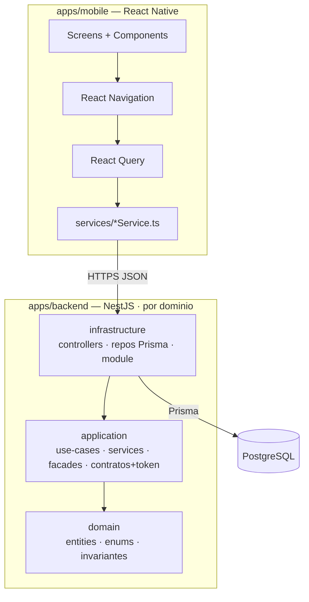
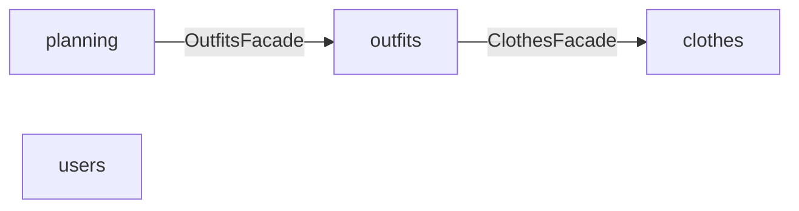

# 02 · Arquitectura del sistema

> Expansión de la sección 2 del [README](../README.md).

## 1. Vista general

Monolito modular: app **React Native** ↔ **API NestJS** ↔ **PostgreSQL (Prisma)**.
El backend se organiza por **bounded context** (dominio) y, dentro de cada uno, en
**tres capas físicas** con una regla de dependencias estricta:
`infrastructure → application → domain`. Las flechas apuntan **hacia adentro**:
`domain` no conoce a nadie; `application` no conoce `infrastructure`.

- **domain** — el modelo de negocio puro: entidades (clases planas), enums e invariantes.
  No sabe nada de NestJS, Prisma ni transporte.
- **application** — casos de uso y lógica de aplicación. Define **contratos** (interfaces
  de repositorio + token de inyección) de todo lo externo que necesita, sin conocer su
  implementación. Contiene `use-cases` (un `execute()` por caso), `services` internos,
  `facades` (la API pública del dominio) y `dtos`.
- **infrastructure** — los detalles técnicos. Implementa los contratos de `application`
  (Prisma, HTTP, clientes de terceros) y hace el wiring de Nest. Aquí viven los
  `controllers` y los repositorios Prisma (único lugar donde se mapea modelo Prisma ↔
  entidad de dominio).

La comunicación entre dominios ocurre **siempre a través de la facade** del otro dominio;
ningún dominio importa repos/services/use-cases ajenos ni accede a tablas de otro dominio.



> Regla de oro: las flechas apuntan hacia adentro. `domain` es el centro y no importa de
> ninguna otra capa; `application` nunca importa de `infrastructure` ni del cliente de Prisma.

## 2. Decisiones de arquitectura (ADR resumidos)

| Decisión | Elección | Razón |
|----------|----------|-------|
| Workspace | Monorepo "apps/ simple" | Front y back juntos sin tooling extra; un solo repo del proyecto final. |
| Backend framework | NestJS + DDD por capas | Estructura clara por dominio; alineado con experiencia del autor. |
| Capas por dominio | `domain` / `application` / `infrastructure` | Regla `infra → application → domain`; dominio puro y testeable, infra reemplazable. |
| Acoplamiento entre módulos | Solo vía **facade** del otro dominio | Boundary explícito; evita acceso directo a repos/tablas ajenas. |
| Inyección de dependencias | Contra contratos vía token (`@Inject(SYMBOL)`) | El dominio depende de interfaces, no de clases concretas de infra. |
| ORM / DB | Prisma + PostgreSQL | Dominio relacional (N:M tags/ocasiones, OutfitItem); migraciones y tipado fuertes. |
| Single-user en MVP | `userId` fijo vía guard | Evita el costo de auth sin condicionar el modelo (todas las entidades ya tienen `userId`). |
| Planning = 1 activo | Estado `planned/confirmed/cancelled` | Fiel al producto "próximo outfit"; `plannedFor` deja abierto el calendario. |
| Imágenes | Filesystem local (MVP) | Sin dependencia de cloud para el entregable; el contrato API expone sólo URLs. |

## 3. Estructura de ficheros — backend

Bounded contexts: **`clothes`** (`ClothingItem` + catálogos `Category`, `Color`, `Tag`,
`Occasion`), **`outfits`** (`Outfit`, `OutfitItem`), **`planning`** (`PlannedOutfit`) y
**`users`** (`User`, single-user en MVP).

```
apps/backend/
├── prisma/
│   └── schema.prisma             # recurso compartido de infra (fuera de los dominios)
└── src/
    ├── main.ts
    ├── app.module.ts             # importa PrismaModule + los 4 módulos de dominio
    ├── shared/                   # infra transversal (sin lógica de negocio)
    │   ├── prisma/               # PrismaService + PrismaModule (@Global)
    │   ├── auth/                 # @CurrentUser() + CurrentUserGuard (userId fijo en MVP)
    │   └── types/                # contratos compartidos (p. ej. Paginated<T>)
    └── {domain}/                 # clothes · outfits · planning · users
        ├── domain/
        │   ├── entities/         # clases planas; sin framework ni Prisma
        │   ├── enums/
        │   └── utils/            # invariantes puras (ej. outfit ≥2 prendas)
        ├── application/
        │   ├── repositories/     # SOLO interfaces (contratos) + token SYMBOL
        │   ├── use-cases/        # un caso de uso = una clase con un único execute()
        │   ├── services/         # lógica reutilizable interna del dominio
        │   ├── facades/          # API pública del dominio (lo único que ven otros)
        │   ├── emitters/         # eventos de dominio — fuera del MVP (Épica 2/3)
        │   └── dtos/             # class-validator
        └── infrastructure/
            ├── controllers/      # entrada HTTP, delgada; delega a use-cases
            ├── persistence/
            │   └── repositories/ # impl Prisma de los contratos; mapea modelo ↔ entidad
            ├── repositories/     # adapters a servicios externos (si aplica)
            └── {domain}.module.ts  # wiring: providers + exports (solo facades)
```

Responsabilidades por capa:

| Capa | Ubicación | Responsabilidad |
|------|-----------|-----------------|
| Entity / enum / util | `domain/` | Modelo y reglas puras (ej. outfit ≥2 prendas, 1 planned activo). Sin NestJS ni Prisma. |
| Repository (contrato) | `application/repositories/` | Interface + token `SYMBOL`; tipos en entidades de dominio, nunca modelos Prisma. |
| Use case | `application/use-cases/` | Un `execute()`: valida, orquesta repos/services/facades, aplica el flujo. |
| Service | `application/services/` | Lógica reutilizable entre use-cases del dominio. Interno (no se exporta). |
| Facade | `application/facades/` | API pública del dominio hacia otros dominios. Única cosa exportada. |
| Controller | `infrastructure/controllers/` | Adaptador de entrada HTTP. Delgado, delega a use-cases. **Sin lógica.** |
| Repository (Prisma) | `infrastructure/persistence/repositories/` | Implementa el contrato; único lugar del mapeo modelo Prisma ↔ entidad. |
| Module | `infrastructure/{domain}.module.ts` | Wiring: `providers` (use-cases, services, facades, binding contrato→impl); `exports` solo facades. |

## 3 bis. Límites entre dominios (cruce solo vía facade)

Cada dominio expone **una facade**; ningún dominio importa repos/services/use-cases de
otro ni toca sus tablas. Grafo de dependencias (sin ciclos):

| Dominio | Consume vía facade | Para qué |
|---------|--------------------|----------|
| `clothes` | — | dueño de sus catálogos (`Category`/`Color`/`Tag`/`Occasion`); valida referencias internamente |
| `outfits` | `ClothesFacade` | validar que cada `clothingItemId` existe, está activo y es del usuario; y `occasionIds` / `tagIds` |
| `planning` | `OutfitsFacade` | validar que el `outfitId` a planear existe y está activo |
| `users` | — | standalone; provee `@CurrentUser` (nadie lo cruza en MVP) |



## 4. Estructura de ficheros — mobile

```
apps/mobile/src/
├── screens/{clothes,outfits,planning,settings,search,modals}/
├── components/{common,clothes,outfits,planning,filters,search}/
├── features/{clothes,outfits,planning}/{components,hooks,services,state}
├── navigation/   # RootNavigator, MainTabs, *Stack, ModalStack, types
├── services/     # apiClient + *Service por dominio
├── hooks/        # useApi, useDebounce, ...
├── state/        # store (Zustand) + slices ui/filtros
├── domain/models # tipos espejo de las entidades
└── utils/ constants/ types/ config/
```

Recomendaciones de implementación:

| Área | Elección |
|------|----------|
| Navegación | React Navigation v6 (tabs + stacks + modales) |
| Estado servidor | React Query (cache, loading, retry) |
| Estado UI | Zustand (filtros activos, modales) |
| Formularios | React Hook Form + Zod |
| Imágenes | react-native-image-picker |
| Tests | Jest + React Native Testing Library |

## 5. Seguridad y despliegue

Ver [09-SECURITY-TESTING.md](09-SECURITY-TESTING.md). Despliegue: local en el MVP
(Docker Postgres + dev servers); containerización y Postgres gestionado quedan fuera
del entregable 1.
