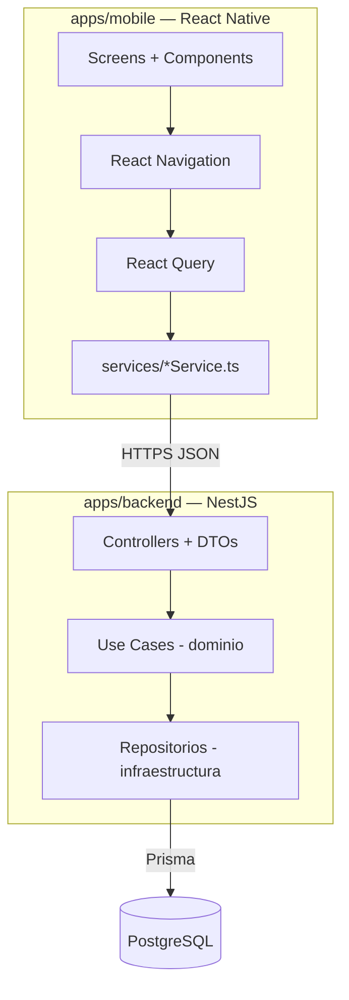

# 02 · Arquitectura del sistema

> Expansión de la sección 2 del [README](../README.md).

## 1. Vista general

Monolito modular: app **React Native** ↔ **API NestJS** ↔ **PostgreSQL (Prisma)**.
El backend se organiza por dominios (DDD ligero): cada módulo es un agregado con su
capa de **dominio** (entidades + casos de uso + interfaces de repositorio) y su capa de
**infraestructura** (adaptadores). Los **controllers y DTOs son adaptadores de entrada**
(inbound) y por eso viven en `infrastructure/http/`; los repositorios Prisma y mappers
son adaptadores de salida (outbound). El dominio no conoce a la infraestructura.



## 2. Decisiones de arquitectura (ADR resumidos)

| Decisión | Elección | Razón |
|----------|----------|-------|
| Workspace | Monorepo "apps/ simple" | Front y back juntos sin tooling extra; un solo repo del proyecto final. |
| Backend framework | NestJS + DDD ligero | Estructura clara por dominio; alineado con experiencia del autor. |
| ORM / DB | Prisma + PostgreSQL | Dominio relacional (N:M tags/ocasiones, OutfitItem); migraciones y tipado fuertes. |
| Single-user en MVP | `userId` fijo vía guard | Evita el costo de auth sin condicionar el modelo (todas las entidades ya tienen `userId`). |
| Planning = 1 activo | Estado `planned/confirmed/cancelled` | Fiel al producto "próximo outfit"; `plannedFor` deja abierto el calendario. |
| Imágenes | Filesystem local (MVP) | Sin dependencia de cloud para el entregable; el contrato API expone sólo URLs. |

## 3. Estructura de ficheros — backend

```
apps/backend/src/
├── modules/
│   ├── clothes/        # ClothingItem, Category, Color, Tag, Occasion
│   ├── outfits/        # Outfit, OutfitItem
│   ├── planning/       # PlannedOutfit
│   └── users/          # User (single-user en MVP)
│       ├── domain/
│       │   ├── entities/         # reglas de negocio
│       │   ├── repositories/     # interfaces (puertos)
│       │   └── use-cases/        # orquestación
│       └── infrastructure/       # adaptadores
│           ├── http/             # adaptador de ENTRADA
│           │   ├── controllers/  # endpoints; validan DTO, llaman use case
│           │   └── dto/          # class-validator
│           ├── repositories/     # adaptador de SALIDA: impl Prisma
│           └── mappers/          # entity <-> prisma model
├── common/             # filters, interceptors, decorators (CurrentUser)
├── prisma/             # schema.prisma, seed.ts, migrations/
├── app.module.ts
└── main.ts
```

Responsabilidades por capa:

| Capa | Ubicación | Responsabilidad |
|------|-----------|-----------------|
| Controller + DTO | `infrastructure/http/` | Adaptador de entrada: HTTP, validación de DTO, mapping a/desde respuesta. **Sin lógica de negocio.** |
| Use case | `domain/use-cases/` | Lógica de aplicación; orquesta entidades + repos. |
| Entity | `domain/entities/` | Invariantes de dominio (ej. outfit ≥2 prendas, 1 planned activo). |
| Repository (interface) | `domain/repositories/` | Puerto: contrato de persistencia. |
| Repository (Prisma) + mappers | `infrastructure/` | Adaptador de salida: implementación real. |

## 4. Estructura de ficheros — mobile

```
apps/mobile/src/
├── screens/{clothes,outfits,planning,settings,search,modals}/
├── components/{common,clothes,outfits,planning,filters,search}/
├── features/{clothes,outfits,planning}/{components,hooks,services,state}
├── navigation/   # RootNavigator, MainTabs, *Stack, ModalStack, types
├── services/     # apiClient + *Service por dominio
├── hooks/        # useApi, useDebounce, ...
├── state/        # store (Zustand) + slices ui/filtros
├── domain/models # tipos espejo de las entidades
└── utils/ constants/ types/ config/
```

Recomendaciones de implementación:

| Área | Elección |
|------|----------|
| Navegación | React Navigation v6 (tabs + stacks + modales) |
| Estado servidor | React Query (cache, loading, retry) |
| Estado UI | Zustand (filtros activos, modales) |
| Formularios | React Hook Form + Zod |
| Imágenes | react-native-image-picker |
| Tests | Jest + React Native Testing Library |

## 5. Seguridad y despliegue

Ver [09-SECURITY-TESTING.md](09-SECURITY-TESTING.md). Despliegue: local en el MVP
(Docker Postgres + dev servers); containerización y Postgres gestionado quedan fuera
del entregable 1.
