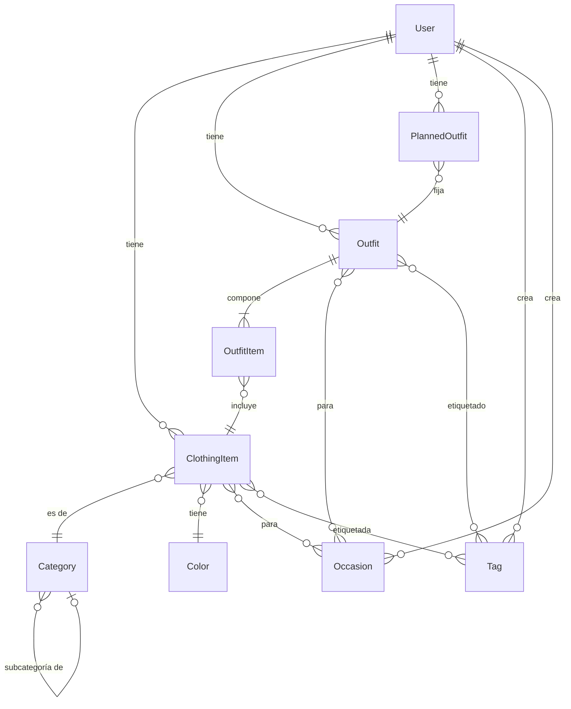

# 03 · Modelo de datos

> Expansión de la sección 3 del [README](../README.md). Persistencia: **PostgreSQL + Prisma**.

## 1. Diagrama ER (MVP)



## 2. Entidades

### User
| Campo | Tipo | Notas |
|-------|------|-------|
| id | UUID (PK) | |
| email | string | único; en MVP se siembra un registro fijo |
| name | string | |
| photoUrl | string? | de Google en el futuro |
| createdAt / updatedAt | datetime | |

> **MVP:** existe un único User sembrado. El `userId` se inyecta vía `@CurrentUser()`
> (guard). Con auth (Épica 1) el guard resuelve el usuario desde el JWT sin tocar los
> casos de uso.

### ClothingItem
| Campo | Tipo | Reglas |
|-------|------|--------|
| id | UUID (PK) | |
| userId | UUID (FK) | |
| name | string | obligatorio |
| categoryId | UUID (FK) | obligatorio |
| colorId | UUID (FK) | obligatorio |
| description | string? | |
| imageUrls | string[] | 0..N |
| isActive | boolean | archivado lógico (default true) |
| createdAt / updatedAt | datetime | |
| occasions | N:M `Occasion` | vía `ClothingItemOccasion` |
| tags | N:M `Tag` | vía `ClothingItemTag` |

### Category (catálogo)
| Campo | Tipo | Notas |
|-------|------|-------|
| id, name | UUID, string | name único |
| icon | string? | |
| parentCategoryId | UUID? | jerarquía opcional |

### Color (catálogo)
| Campo | Tipo | Notas |
|-------|------|-------|
| id, name | UUID, string | name único |
| hexCode | string | obligatorio, ej. `#FF5733` |

### Tag
| Campo | Tipo | Notas |
|-------|------|-------|
| id, name | UUID, string | name único por usuario |
| userId | UUID? | creada por el usuario |

### Occasion
| Campo | Tipo | Notas |
|-------|------|-------|
| id, name | UUID, string | |
| icon | string? | |
| isGlobal | boolean | true = catálogo; false = propia del usuario |

### Outfit
| Campo | Tipo | Reglas |
|-------|------|--------|
| id | UUID (PK) | |
| userId | UUID (FK) | |
| name | string | obligatorio |
| isActive | boolean | archivado lógico |
| createdAt / updatedAt | datetime | |
| items | 1:N `OutfitItem` | **mín. 2** (invariante de dominio) |
| occasions / tags | N:M | |

### OutfitItem
| Campo | Tipo | Reglas |
|-------|------|--------|
| id | UUID (PK) | |
| outfitId | UUID (FK) | |
| clothingItemId | UUID (FK) | |
| order | int | orden visual |
| | | único (outfitId, clothingItemId) |

### PlannedOutfit
| Campo | Tipo | Reglas |
|-------|------|--------|
| id | UUID (PK) | |
| userId | UUID (FK) | |
| outfitId | UUID (FK) | |
| plannedFor | datetime? | **punto de extensión → calendario (Épica 2)** |
| status | enum | `planned` \| `confirmed` \| `cancelled` |
| createdAt / updatedAt | datetime | |

> **Invariante:** un solo `PlannedOutfit` con `status=planned` por usuario. Al fijar uno
> nuevo, el anterior pasa a `cancelled`.

## 3. Entidades futuras (NO en MVP)

- **OutfitHistory** — `id, userId, outfitId, dateUsed, occasionId?, status(used|skipped)`.
- **OutfitRating** — `id, outfitHistoryId, rating(1-5), comfortLevel?, styleRating?, notes?`.

## 4. Esquema Prisma (extracto)

```prisma
model ClothingItem {
  id          String   @id @default(uuid())
  userId      String
  name        String
  categoryId  String
  colorId     String
  description String?
  imageUrls   String[]
  isActive    Boolean  @default(true)
  createdAt   DateTime @default(now())
  updatedAt   DateTime @updatedAt

  user     User      @relation(fields: [userId], references: [id])
  category Category  @relation(fields: [categoryId], references: [id])
  color    Color     @relation(fields: [colorId], references: [id])
  occasions ClothingItemOccasion[]
  tags      ClothingItemTag[]
  outfitItems OutfitItem[]
}

model Outfit {
  id        String   @id @default(uuid())
  userId    String
  name      String
  isActive  Boolean  @default(true)
  createdAt DateTime @default(now())
  updatedAt DateTime @updatedAt
  items     OutfitItem[]
  // ... occasions / tags N:M
}

model OutfitItem {
  id             String @id @default(uuid())
  outfitId       String
  clothingItemId String
  order          Int
  outfit       Outfit       @relation(fields: [outfitId], references: [id])
  clothingItem ClothingItem @relation(fields: [clothingItemId], references: [id])
  @@unique([outfitId, clothingItemId])
}

enum PlannedStatus { planned confirmed cancelled }

model PlannedOutfit {
  id         String        @id @default(uuid())
  userId     String
  outfitId   String
  plannedFor DateTime?
  status     PlannedStatus @default(planned)
  createdAt  DateTime      @default(now())
  updatedAt  DateTime      @updatedAt
}
```

## 5. Datos semilla (`npm run seed`)

- **User** fijo (single-user MVP).
- **Categories**: camiseta, pantalón, vestido, abrigo, calzado, accesorio (con jerarquía base).
- **Colors**: paleta base con `hexCode`.
- **Occasions** globales: trabajo, casual, formal, deporte, fiesta.

## Modelos (derivado de `schema.prisma`)

<!-- AUTO-GENERATED:data-model:start -->
<!-- Generado por scripts/arch-docs.py — no editar a mano dentro de este bloque. -->

### enum `PlannedStatus`

Valores: `planned`, `confirmed`, `cancelled`

### model `Category`

| Campo | Tipo |
|---|---|
| `id` | `String` |
| `name` | `String` |
| `icon` | `String?` |
| `parentCategoryId` | `String?` |
| `parent` | `Category?` |
| `children` | `Category[]` |
| `clothingItems` | `ClothingItem[]` |

### model `ClothingItem`

| Campo | Tipo |
|---|---|
| `id` | `String` |
| `userId` | `String` |
| `name` | `String` |
| `categoryId` | `String` |
| `colorId` | `String` |
| `description` | `String?` |
| `imageUrls` | `String[]` |
| `isActive` | `Boolean` |
| `createdAt` | `DateTime` |
| `updatedAt` | `DateTime` |
| `user` | `User` |
| `category` | `Category` |
| `color` | `Color` |
| `occasions` | `ClothingItemOccasion[]` |
| `tags` | `ClothingItemTag[]` |
| `outfitItems` | `OutfitItem[]` |

### model `ClothingItemOccasion`

| Campo | Tipo |
|---|---|
| `clothingItemId` | `String` |
| `occasionId` | `String` |
| `clothingItem` | `ClothingItem` |
| `occasion` | `Occasion` |

### model `ClothingItemTag`

| Campo | Tipo |
|---|---|
| `clothingItemId` | `String` |
| `tagId` | `String` |
| `clothingItem` | `ClothingItem` |
| `tag` | `Tag` |

### model `Color`

| Campo | Tipo |
|---|---|
| `id` | `String` |
| `name` | `String` |
| `hexCode` | `String` |
| `clothingItems` | `ClothingItem[]` |

### model `Occasion`

| Campo | Tipo |
|---|---|
| `id` | `String` |
| `name` | `String` |
| `icon` | `String?` |
| `isGlobal` | `Boolean` |
| `userId` | `String?` |
| `user` | `User?` |
| `clothingItems` | `ClothingItemOccasion[]` |
| `outfits` | `OutfitOccasion[]` |

### model `Outfit`

| Campo | Tipo |
|---|---|
| `id` | `String` |
| `userId` | `String` |
| `name` | `String` |
| `isActive` | `Boolean` |
| `createdAt` | `DateTime` |
| `updatedAt` | `DateTime` |
| `user` | `User` |
| `items` | `OutfitItem[]` |
| `occasions` | `OutfitOccasion[]` |
| `tags` | `OutfitTag[]` |
| `plannedOutfits` | `PlannedOutfit[]` |

### model `OutfitItem`

| Campo | Tipo |
|---|---|
| `id` | `String` |
| `outfitId` | `String` |
| `clothingItemId` | `String` |
| `order` | `Int` |
| `outfit` | `Outfit` |
| `clothingItem` | `ClothingItem` |

### model `OutfitOccasion`

| Campo | Tipo |
|---|---|
| `outfitId` | `String` |
| `occasionId` | `String` |
| `outfit` | `Outfit` |
| `occasion` | `Occasion` |

### model `OutfitTag`

| Campo | Tipo |
|---|---|
| `outfitId` | `String` |
| `tagId` | `String` |
| `outfit` | `Outfit` |
| `tag` | `Tag` |

### model `PlannedOutfit`

| Campo | Tipo |
|---|---|
| `id` | `String` |
| `userId` | `String` |
| `outfitId` | `String` |
| `plannedFor` | `DateTime?` |
| `status` | `PlannedStatus` |
| `createdAt` | `DateTime` |
| `updatedAt` | `DateTime` |
| `user` | `User` |
| `outfit` | `Outfit` |

### model `Tag`

| Campo | Tipo |
|---|---|
| `id` | `String` |
| `name` | `String` |
| `userId` | `String?` |
| `user` | `User?` |
| `clothingItems` | `ClothingItemTag[]` |
| `outfits` | `OutfitTag[]` |

### model `User`

| Campo | Tipo |
|---|---|
| `id` | `String` |
| `email` | `String` |
| `name` | `String` |
| `photoUrl` | `String?` |
| `createdAt` | `DateTime` |
| `updatedAt` | `DateTime` |
| `clothingItems` | `ClothingItem[]` |
| `outfits` | `Outfit[]` |
| `plannedOutfits` | `PlannedOutfit[]` |
| `tags` | `Tag[]` |
| `occasions` | `Occasion[]` |

<!-- AUTO-GENERATED:data-model:end -->
