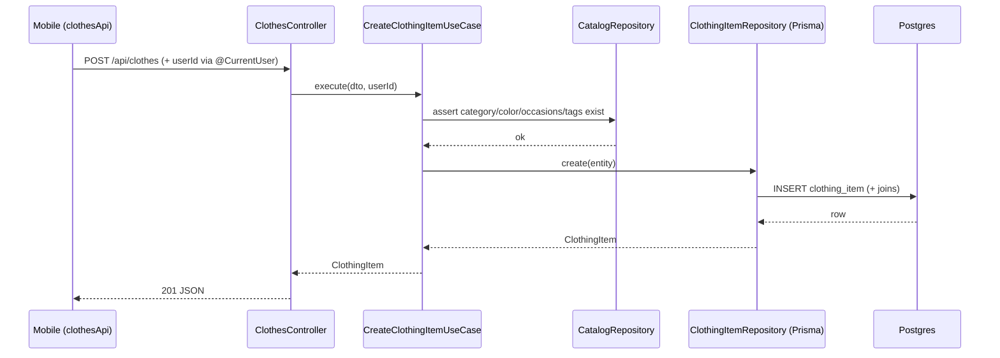

# Armario digital (dominio Clothes) — primer feature del MVP

- **Status:** shipped (backend + mobile + deploy AWS verificados 2026-06-28)
- **Size class:** risky (introduce la base de datos, los primeros contratos HTTP de producto y el patrón DDD que copiarán `outfits`/`planning`)
- **Owner:** @backend-architect
- **Ticket:** no aplica (sin tickets en el MVP)
- **Created:** 2026-06-28

> Spec del "qué" + `## Technical design` (el "cómo"). Es el **primer feature de producto**:
> establece la base (Prisma + Postgres + guard `@CurrentUser` + patrón de dominio por capas)
> sobre la que se construyen `outfits` y `planning`. La consistencia estructural es el activo.

## Problema

Hoy el backend sólo expone `GET /api/health` (liveness, sin DB). No hay forma de gestionar el
**armario digital**: el usuario no puede registrar sus prendas, ni el sistema persistir nada.
Sin el dominio `clothes` —dueño de `ClothingItem` y de los catálogos `Category`/`Color`/`Tag`/
`Occasion`— no existe el primer eslabón del core flow `Prendas → Outfits → Outfit listo`:
`outfits` necesita validar prendas vía `ClothesFacade` antes de poder componer conjuntos.

## Goals

- El usuario puede **crear, listar, ver, editar y archivar** prendas (`ClothingItem`) vía HTTP.
- El usuario puede **consultar los catálogos** sembrados (categories, colors, occasions) y
  **crear** tags/occasions propias para etiquetar prendas.
- Queda en pie la **base de persistencia**: Postgres en Docker (dev), Prisma con el esquema MVP
  completo migrado, `PrismaModule` global y seed reproducible (`npm run seed`).
- Queda en pie el **guard `@CurrentUser`** (single-user MVP, `userId` fijo) que inyecta el
  usuario en los controllers sin que los use-cases sepan de auth.
- El dominio `clothes` queda scaffoldeado con el patrón DDD por capas (`/new-domain`) y
  expone `ClothesFacade` para que `outfits` lo consuma después.
- `npm run lint:arch` pasa y existe el spec de cada use-case principal (reglas de test §4).

## Non-goals

- **No** incluye `outfits` ni `planning` (features siguientes; sólo se deja la `ClothesFacade`
  y el esquema Prisma de esas tablas para no re-migrar).
- ~~**No** incluye **subida real de imágenes** (S3/filesystem): `imageUrls` se acepta como
  array de strings ya resueltos; la captura de fotos en mobile usa URLs locales/placeholder.~~
  **Actualizado:** la subida real de imágenes vía **S3/MinIO** ya está **en alcance e
  implementada** (endpoints `POST /api/clothes/images` + `GET /api/clothes/images/:key`).
  El contrato JSON de `clothes` no cambia: `imageUrls` sigue siendo un array de strings de
  URL — ahora esas URLs las devuelve el endpoint de subida. Detalle en
  [`clothes-image-upload.md`](clothes-image-upload.md).
- **No** incluye autenticación real (Google/JWT): el guard resuelve un `userId` fijo sembrado.
- **No** incluye jerarquía de categorías editable por el usuario (el `parentCategoryId` se
  siembra; no hay endpoint para crearla).
- **No** incluye paginación con cursor: paginación por `page`/`limit` (offset) como en `docs/04`.

## Módulos / servicios afectados

- `apps/backend` — **nuevo dominio** `src/clothes/` (domain/application/infrastructure).
- `apps/backend` — infra transversal nueva: `src/shared/prisma/` (PrismaService + módulo global)
  y `src/shared/auth/` (`@CurrentUser` + guard) y `src/shared/types/` (`Paginated<T>`).
- `apps/backend/prisma/schema.prisma` — **nuevo**: esquema MVP completo (User, Category, Color,
  Tag, Occasion, ClothingItem + join tables, Outfit, OutfitItem, PlannedOutfit + enum).
- `apps/backend/prisma/seed.ts` — **nuevo**: user fijo + catálogos.
- `apps/backend/compose.dev.yaml` (o servicio `postgres` en dev) — Postgres local.
- `apps/backend/src/app.module.ts` — importa `PrismaModule` + `ClothesModule`.
- `apps/mobile` — **nuevo**: base Expo + feature `clothes` (lista + alta de prenda).

## Contratos afectados

| Tipo | Superficie | Cambio | ¿Rompe? | Consumidores |
|---|---|---|---|---|
| HTTP | `GET/POST/PUT/DELETE /api/clothes` | nuevo | no | `apps/mobile` (clothesApi) |
| HTTP | `GET /api/clothes/categories\|colors\|occasions\|tags` | nuevo | no | `apps/mobile` |
| HTTP | `POST /api/clothes/tags`, `POST /api/clothes/occasions` | nuevo | no | `apps/mobile` |
| DB | esquema MVP completo (Prisma) | nuevo | no | backend |
| Tipo compartido | `Paginated<T>` en `src/shared/types` | nuevo | no | backend |

## Impacto backend

Se crea el dominio `clothes` siguiendo `infra → application → domain`:
- **domain**: entidades planas `ClothingItem`, `Category`, `Color`, `Tag`, `Occasion`.
- **application**: contratos de repositorio (`ClothingItemRepository`, `CatalogRepository`) con
  token SYMBOL; use-cases con un solo `execute()` (`create/list/get/update/archive-clothing-item`,
  `list-categories/colors/occasions/tags`, `create-tag/occasion`); `ClothesFacade` (API pública
  que `outfits` consumirá: `findActiveItemById`, `assertItemsExist`); dtos con class-validator.
- **infrastructure**: `ClothesController` delgado (delega a use-cases), repos Prisma en
  `persistence/repositories` (único lugar que toca `@prisma/client`), `ClothesModule` (wiring,
  exporta sólo la facade). Prisma confinado a `shared/prisma` + `infrastructure/persistence`.

## Impacto frontend

Se crea la base de `apps/mobile` (Expo + NativeWind + React Navigation + TanStack Query) y la
feature `clothes`: pantalla **lista de prendas** (`GET /api/clothes`) y **alta de prenda**
(formulario con RHF + Zod → `POST /api/clothes`, eligiendo category/color/occasions de los
catálogos). Estado servidor vía TanStack Query; sin Zustand en esta vuelta (no hay estado
compartido entre pantallas todavía).

## Impacto de base de datos

**Migración Prisma inicial** (`init`): crea todas las tablas del MVP. Seed (`npm run seed`):
1 User fijo, categorías base (con jerarquía), paleta de colores, occasions globales. La
migración corre con `prisma migrate dev` en local (Postgres docker).

## Edge cases

- `POST /api/clothes` sin `name`/`categoryId`/`colorId` → `400` (class-validator).
- `POST /api/clothes` con `categoryId`/`colorId`/`occasionId`/`tagId` inexistente → `400`/`404`
  (se valida referencia contra catálogo, no FK ciega).
- `GET /api/clothes/:id` de una prenda archivada o de otro usuario → `404`.
- `DELETE /api/clothes/:id` → archiva (`isActive=false`), no borra; vuelve a listar sin ella.
- Crear tag/occasion con `name` duplicado (por usuario) → idempotente o `409` (definir abajo).
- Listar con filtros combinados (`categoryId` + `search`) → AND.

## Criterios de aceptación

- [ ] `docker compose -f compose.dev.yaml up -d postgres` + `npx prisma migrate dev` + `npm run seed`
      dejan la DB lista; `npm run start:dev` arranca sin errores.
- [ ] `GET /api/clothes/categories` devuelve el catálogo sembrado (≥5 categorías).
- [ ] `POST /api/clothes` con body válido → `201` y devuelve la prenda con `id`, `category`,
      `color`, `isActive:true`.
- [ ] `POST /api/clothes` sin `name` → `400`.
- [ ] `GET /api/clothes` lista las prendas activas del usuario, paginado `{data,total,page,limit}`.
- [ ] `GET /api/clothes/:id` devuelve la prenda con relaciones; `404` si no existe/archivada.
- [ ] `PUT /api/clothes/:id` actualiza campos parciales.
- [ ] `DELETE /api/clothes/:id` → `{success:true}` y la prenda deja de aparecer en el listado.
- [ ] `npm run lint:arch` pasa (sin violaciones de capas/facade).
- [ ] `npx jest src/clothes --no-coverage` pasa (specs de los use-cases principales).
- [ ] Mobile: la pantalla de lista muestra las prendas creadas y el alta crea una prenda nueva
      visible tras refrescar.

## Plan de test

- **Unit:** specs de los use-cases con mayor lógica: `create-clothing-item` (valida catálogos),
  `archive-clothing-item` (archivado lógico), `list-clothing-items` (filtros + paginación).
  Spies sobre el contrato del repo (no Prisma real). 1–2 asserts por comportamiento.
- **E2E:** `/e2e-local` — flujo HTTP real: catálogos → crear 2 prendas → listar → ver →
  editar → archivar → verificar que no aparece. Sólo HTTP, DB local docker.
- **Mobile:** smoke manual de lista + alta contra la API local.

## Rollout

- **Feature flag:** no aplica en MVP.
- **Orden de despliegue:** DB (migración + seed) → backend (dominio) → mobile.
- **Rollback:** al ser el primer dominio con DB, rollback = revertir la migración
  (`prisma migrate resolve`/recrear DB en dev) + revertir el merge. Sin datos productivos.

## Preguntas abiertas

- [x] Q: ¿Esquema Prisma completo o sólo tablas de clothes? → **Completo** (evita re-migrar al
      sumar outfits/planning; las tablas existen aunque sin código que las use aún). Owner: @backend-architect.
- [x] Q: ¿Tag/occasion duplicada? → **Idempotente**: si existe (mismo `name`+`userId`) se
      devuelve la existente (`200`), no error. Owner: @backend-architect.
- [x] Q: ¿Validación de catálogos en create? → **Sí**, se valida que category/color existan y
      que occasion/tag ids referencien filas reales antes de crear. Owner: @backend-architect.

---

## Technical design

> Resuelto por el **Backend Architect** (2026-06-28).

### Resumen del enfoque

El dominio `clothes` es el **molde** de los dominios siguientes: por eso se invierte en dejar
el patrón limpio (entidades planas, contratos con token, use-cases de un `execute()`, facade
como única superficie pública, Prisma confinado). La persistencia se introduce como infra
transversal (`shared/prisma`, `@Global`) para que cualquier dominio la inyecte sin acoplarse.
El guard `@CurrentUser` resuelve un `userId` fijo (el user sembrado) leyéndolo de env, de modo
que el día que entre auth real sólo cambia el guard, no los use-cases ni los controllers.

Catálogos (`Category`/`Color`/`Occasion`/`Tag`) son propiedad de `clothes`: viven en su
repositorio (`CatalogRepository`) y se exponen por endpoints `GET /api/clothes/{catalogo}`.
`outfits` los consultará vía `ClothesFacade`, nunca tocando sus tablas.

### Contratos cambiados (detalle)

| Contrato | Shape viejo | Shape nuevo | Acción del consumidor |
|---|---|---|---|
| `POST /api/clothes` | no existía | body `{name, categoryId, colorId, description?, occasionIds?, tagIds?, imageUrls?}` → `201 ClothingItem` | mobile `clothesApi.create` |
| `GET /api/clothes` | no existía | `{data,total,page,limit}` | mobile `useClothes()` |
| `GET /api/clothes/categories\|colors\|occasions` | no existía | `Catalog[]` | mobile selects del form |
| `ClothesFacade` (interno) | no existía | `findActiveItemById(id,userId)`, `assertItemsExist(ids,userId)` | `outfits` (feature siguiente) |

### Diagrama de secuencia (crear prenda)

### Plan de ejecución

> Una fila = un PR. Ramas desde `feat/clothes-domain` (que sale de `mvp`).

> Implementado en la rama `feat/clothes-domain` (sale de `mvp`); en el MVP no se abren PRs
> separados por fila — se entregó como un conjunto de commits acotados en esa rama.

| # | Fase | Área | Commit | Depende de | Estado |
|---|---|---|---|---|---|
| 1 | Persistencia | backend/infra | Prisma + Postgres (5433) + PrismaModule + esquema MVP + seed | — | merged |
| 2 | Auth scaffold | backend | guard `@CurrentUser` (userId fijo MVP) | #1 | merged |
| 3 | Dominio | backend | dominio clothes DDD + CRUD + catálogos + facade | #2 | merged |
| 4 | Tests | backend | specs create/list/archive (jest) | #3 | merged |
| 5 | E2E | backend | flujo HTTP de clothes (12 pasos PASS) | #3 | merged |
| 6 | Mobile | mobile | base Expo + feature clothes (lista + alta), `tsc` OK | #3 | merged |
| 7 | Review+Deploy | infra/docs | regresión + correspondencia front/back + deploy AWS (Postgres) + docs | #5,#6 | merged |

Estados: `not-started | in-progress | open | merged | blocked`.

### Riesgos

| Riesgo | Severidad | Mitigación |
|---|---|---|
| Esquema MVP completo migrado antes de usar todas las tablas | low | Documentado; outfits/planning sólo agregan código, no migración. Tablas vacías no molestan. |
| El patrón DDD queda mal y se copia mal a outfits/planning | med | `npm run lint:arch` + review estructural contra `/new-domain` antes de cerrar. |
| Guard con userId fijo se filtra a producción como "auth real" | med | Documentado como MVP single-user; el día de auth sólo cambia el guard. |
| Postgres en deploy AWS aún no existe (sólo health) | med | Esta vuelta el deploy AWS sigue siendo el health; la DB en EC2/RDS es iteración aparte (ver Non-goals del deploy). |
