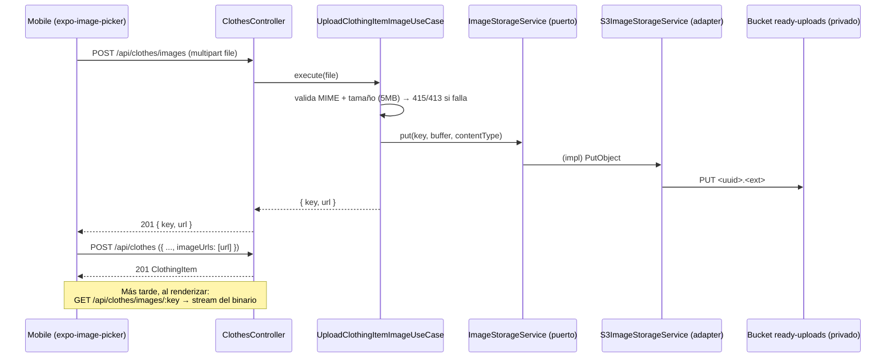

# Subida real de imágenes de prendas (S3/MinIO)

- **Status:** shipped
- **Size class:** medium
- **Owner:** @backend-architect
- **Ticket:** no aplica (sin tickets en el MVP)
- **Created:** 2026-07-04

> Spec del "qué" + `## Technical design` (el "cómo"). Convierte en realidad lo que
> `clothes-domain.md` dejaba como **non-goal**: la subida real de fotos. El contrato JSON de
> `clothes` **no cambia** (`imageUrls` sigue siendo un array de URLs); lo nuevo es de dónde
> salen esas URLs.

## Problema

En el primer feature (`clothes-domain.md`) la subida real de imágenes quedó fuera de alcance:
`imageUrls` se aceptaba como array de strings ya resueltos y en mobile se usaban URLs
locales/placeholder. Eso significaba que el usuario **no podía subir una foto real** de su
prenda: el armario digital mostraba placeholders. Además, `AGENTS.md` exige "usar S3, nunca
guardar uploads en el filesystem del servidor", regla que el placeholder no satisfacía.

## Goals

- El usuario puede **elegir una foto** de su prenda desde mobile y que quede **almacenada** en
  object storage (S3 en prod, MinIO en dev), no en el disco del servidor.
- El backend expone un endpoint de **subida** (`POST /api/clothes/images`) que devuelve la
  `url` final, y un endpoint de **lectura** (`GET /api/clothes/images/:key`) que sirve el
  binario. Esa `url` se guarda tal cual en `imageUrls` de la prenda.
- El **contrato JSON de `clothes` no cambia**: `imageUrls` sigue siendo un array de strings de
  URL; las fotos siguen siendo **opcionales** (0..N por prenda).
- Se respeta la arquitectura DDD por capas (puerto en `application`, adapter S3 en
  `infrastructure`) y `npm run lint:arch` sigue pasando.
- El **bucket es privado**: nunca se expone el host de storage; la API sirve los objetos.

## Non-goals

- **No** presigned/signed URLs (subida directa cliente→S3 o lectura firmada): en el MVP la API
  intermedia siempre (subida vía multipart y lectura vía la API). Queda como item futuro.
- **No** transformaciones de imagen (resize/thumbnails/compresión) en el servidor.
- **No** múltiples archivos por request: `POST /api/clothes/images` sube **una** imagen; para
  N fotos, el cliente llama N veces.
- **No** borrado de objetos huérfanos (garbage collection de imágenes no referenciadas).
- **No** cambia el contrato de `clothes` ni el esquema Prisma (`imageUrls` = array de strings).

## Módulos / servicios afectados

- `apps/backend` — dominio `clothes`: nuevo puerto `application/storage/` (`ImageStorageService`
  + token `IMAGE_STORAGE`), adapter `infrastructure/storage/` (`S3ImageStorageService`), dos
  use-cases (`UploadClothingItemImageUseCase`, `GetClothingItemImageUseCase`) y dos rutas nuevas
  en `ClothesController`.
- `apps/backend/compose.dev.yaml` — servicio **MinIO** (S3-compatible) para dev local + bucket
  `ready-uploads`.
- `apps/backend/src/main.ts` — carga de env vars vía `dotenv` (sin `@nestjs/config`).
- `apps/mobile` — feature `clothes`: la pantalla de alta usa `expo-image-picker` y sube la foto
  antes de crear la prenda.

## Contratos afectados

| Tipo | Superficie | Cambio | ¿Rompe? | Consumidores |
|---|---|---|---|---|
| HTTP | `POST /api/clothes/images` (multipart, campo `file`) | nuevo | no | `apps/mobile` (clothesApi) |
| HTTP | `GET /api/clothes/images/:key` | nuevo | no | `apps/mobile` (render de `imageUrls`) |
| HTTP | `POST/PUT /api/clothes` (`imageUrls`) | sin cambio | no | — (mismo shape: array de URLs) |
| Puerto interno | `ImageStorageService` (token `IMAGE_STORAGE`) | nuevo | no | use-cases de `clothes` |

## Impacto backend

Se agrega al dominio `clothes` sin romper capas: un **puerto** `ImageStorageService` (interface +
token `IMAGE_STORAGE`) en `application/storage/` declara lo que los use-cases necesitan (subir un
buffer, leer por key). El **adapter** `S3ImageStorageService` (usa `@aws-sdk/client-s3`) vive en
`infrastructure/storage/` y es el único que conoce S3/MinIO. Dos use-cases nuevos:
`UploadClothingItemImageUseCase` (valida MIME/tamaño y almacena) y `GetClothingItemImageUseCase`
(recupera por key o `404`). El `ClothesController` gana dos rutas delgadas que delegan a estos
use-cases. El bucket queda **privado**: la API lee objetos con credenciales y los sirve; el host
de storage no se expone.

## Impacto frontend

La pantalla de alta de prenda (`CreateClothingScreen`) usa **`expo-image-picker`** para elegir una
foto, la sube por `multipart/form-data` a `POST /api/clothes/images` y agrega la `url` devuelta a
`imageUrls` en `POST /api/clothes`. La foto es opcional. La lista de prendas ya renderiza
`imageUrls[0]` como miniatura, así que no requiere cambios más allá de apuntar a la URL real.

## Impacto de base de datos

Ninguno. `imageUrls` ya existe en el esquema (`ClothingItem`) como array de strings; sólo cambia
el **origen** de esas URLs (ahora las emite el endpoint de subida). Sin migración ni seed.

## Edge cases

- `POST /api/clothes/images` **sin** `file` → `400`.
- `POST /api/clothes/images` con MIME no permitido (p. ej. `application/pdf`, `image/gif`) → `415`.
- `POST /api/clothes/images` con archivo > 5 MB → `413`.
- `GET /api/clothes/images/:key` con un `key` inexistente → `404`.
- Prenda sin foto: `imageUrls` vacío (`[]`) sigue siendo válido (fotos opcionales, 0..N).

## Criterios de aceptación

- [ ] `POST /api/clothes/images` con un JPEG/PNG/WebP válido → `201` y devuelve
      `{ key, url }` con `url` absoluta y apuntando a `GET /api/clothes/images/:key`.
- [ ] `GET /api/clothes/images/:key` de una imagen subida → `200` con el `Content-Type` correcto
      y `Cache-Control` de larga duración.
- [ ] `POST /api/clothes` con esa `url` en `imageUrls` → `201`, y `GET /api/clothes` la devuelve.
- [ ] `POST /api/clothes/images` sin `file` → `400`; MIME inválido → `415`; > 5 MB → `413`.
- [ ] `GET /api/clothes/images/:key` con key desconocido → `404`.
- [ ] El objeto se almacena en el bucket privado `ready-uploads` (MinIO en dev); el host de
      storage no se expone públicamente.
- [ ] `npm run lint:arch` pasa (puerto en `application`, adapter S3 en `infrastructure`).

## Plan de test

- **Unit:** spec de `UploadClothingItemImageUseCase` (valida MIME/tamaño → delega al puerto;
  rechaza MIME/tamaño inválidos) y de `GetClothingItemImageUseCase` (retorna o `404`), con spy
  sobre el contrato `ImageStorageService` (sin S3 real). 1–2 asserts por comportamiento.
- **E2E:** `/e2e-local` contra MinIO local — subir imagen → `GET` de la imagen → crear prenda con
  la URL → listar y verificar. Más los caminos de error `415` / `400` / `413` / `404`.

## Rollout

- **Feature flag:** no aplica en MVP.
- **Orden de despliegue:** storage (bucket S3 / MinIO) → backend (puerto + adapter + endpoints) →
  mobile (picker + subida).
- **Rollback:** revertir el merge; como `imageUrls` no cambió de shape, las prendas existentes
  siguen válidas (a lo sumo con URLs placeholder previas).

## Preguntas abiertas

- [x] Q: ¿Mecanismo de subida? → **Multipart vía la API** (`POST /api/clothes/images`, campo
      `file`), no subida directa a S3. Mantiene privado el bucket y el contrato JSON intacto.
      Owner: @backend-architect.
- [x] Q: ¿Tamaño máximo? → **5 MB**. Owner: @backend-architect.
- [x] Q: ¿MIME permitidos? → `image/jpeg`, `image/png`, `image/webp`. Owner: @backend-architect.
- [x] Q: ¿Bucket público o privado? → **Privado**, servido por la API (`GET .../images/:key`) con
      credenciales; el host de storage nunca se expone. Owner: @backend-architect.
- [x] Q: ¿Signed URLs? → **Futuro** (fuera del MVP); por ahora la API intermedia siempre.
      Owner: @backend-architect.

---

## Technical design

> Resuelto por el **Backend Architect** (2026-07-04).

### Resumen del enfoque

Se resuelve dentro del dominio `clothes` sin tocar su contrato JSON. La clave es un **puerto**
`ImageStorageService` (interface + token `IMAGE_STORAGE`) en `application/storage/`: los use-cases
dependen de esa abstracción, no de S3. El **adapter** concreto `S3ImageStorageService`
(`@aws-sdk/client-s3`) vive en `infrastructure/storage/` y es intercambiable (AWS S3 en prod,
MinIO S3-compatible en dev). La subida pasa **siempre por la API** (multipart), y la lectura
también (`GET /api/clothes/images/:key` hace stream del objeto): así el **bucket permanece
privado** y el contrato de `clothes` (`imageUrls` = array de URLs) no cambia — sólo cambia quién
produce esas URLs. Config por **env vars** leídas de `process.env` (cargadas por `dotenv` en
`main.ts`; sin `@nestjs/config`).

### Contratos cambiados (detalle)

| Contrato | Shape viejo | Shape nuevo | Acción del consumidor |
|---|---|---|---|
| `POST /api/clothes/images` | no existía | multipart `file` → `201 { key, url }` | mobile: subir foto antes de crear la prenda |
| `GET /api/clothes/images/:key` | no existía | stream del binario (Content-Type + Cache-Control) / `404` | mobile: render de `imageUrls[n]` |
| `POST/PUT /api/clothes` `imageUrls` | array de URLs | array de URLs (**igual**) | ninguna — mismo shape |
| `ImageStorageService` (puerto interno) | no existía | subir buffer / leer por key; token `IMAGE_STORAGE` | use-cases de `clothes` |

### Endpoints (request/response)

**`POST /api/clothes/images`** — `multipart/form-data`, campo `file`. Guardado por el guard
single-user `@CurrentUser`.

```
POST /api/clothes/images
Content-Type: multipart/form-data; boundary=...
--...
Content-Disposition: form-data; name="file"; filename="remera.jpg"
Content-Type: image/jpeg
<binario>
--...--
```
```json
// 201
{ "key": "9f1c...e2.jpg", "url": "http://localhost:3000/api/clothes/images/9f1c...e2.jpg" }
```
Errores: `400` (falta `file`), `415` (MIME fuera de `image/jpeg|png|webp`), `413` (> 5 MB).

**`GET /api/clothes/images/:key`** — devuelve el binario con `Content-Type` del objeto y
`Cache-Control` de larga duración. `404` si el `key` no existe.

### Storage y configuración (env)

- **Prod:** AWS S3. **Dev:** MinIO (S3-compatible) en `compose.dev.yaml`.
- **Bucket:** `ready-uploads` (privado en ambos).
- **Env vars** (leídas de `process.env`, cargadas con `dotenv` en `main.ts`):

| Var | Local (MinIO) | Deploy (AWS) | Notas |
|---|---|---|---|
| `S3_BUCKET_NAME` | `ready-uploads` | `ready-uploads` | nombre del bucket |
| `AWS_REGION` | p. ej. `us-east-1` | región real | requerido por el SDK |
| `S3_ENDPOINT` | URL de MinIO | *(vacío)* | sólo MinIO; vacío en AWS real |
| `S3_FORCE_PATH_STYLE` | `true` | `false`/vacío | MinIO requiere path-style |
| `S3_ACCESS_KEY` | credencial MinIO | *(vacío)* | vacío en AWS → usa rol IAM |
| `S3_SECRET_KEY` | credencial MinIO | *(vacío)* | vacío en AWS → usa rol IAM |
| `IMAGE_PUBLIC_BASE_URL` | `http://localhost:3000` | `https://<DOMAIN>` | base de la API para armar `url` |

`IMAGE_PUBLIC_BASE_URL` apunta a la **base de la API** (no al host de storage): la `url`
devuelta se compone como `${IMAGE_PUBLIC_BASE_URL}/api/clothes/images/${key}`, lo que mantiene
el bucket detrás de la API.

### Diagrama de secuencia (subir foto + crear prenda)



### Plan de ejecución

> Implementado en la rama del feature de imágenes (sale de `mvp`); en el MVP no se abren PRs
> separados por fila — se entregó como un conjunto de commits acotados.

| # | Fase | Área | Commit | Depende de | Estado |
|---|---|---|---|---|---|
| 1 | Storage dev | backend/infra | MinIO en `compose.dev.yaml` + bucket `ready-uploads` + env vars | — | merged |
| 2 | Puerto | backend (application) | `ImageStorageService` + token `IMAGE_STORAGE` en `application/storage/` | #1 | merged |
| 3 | Adapter | backend (infrastructure) | `S3ImageStorageService` (`@aws-sdk/client-s3`) en `infrastructure/storage/` | #2 | merged |
| 4 | Use-cases + endpoints | backend | `UploadClothingItemImageUseCase` + `GetClothingItemImageUseCase` + rutas en `ClothesController` | #3 | merged |
| 5 | Tests | backend | specs de los use-cases (jest) | #4 | merged |
| 6 | E2E | backend | flujo upload→GET→create→list + 415/400/413/404 (MinIO local) | #4 | merged |
| 7 | Mobile | mobile | `expo-image-picker` en alta → subida multipart → `url` en `imageUrls` | #4 | merged |

Estados: `not-started | in-progress | open | merged | blocked`.

### Verificación

- **E2E local (happy path):** subir imagen (`POST /api/clothes/images` → `201 { key, url }`) →
  `GET /api/clothes/images/:key` (`200`, Content-Type correcto) → crear prenda con esa `url`
  (`POST /api/clothes` → `201`) → `GET /api/clothes` muestra la prenda con su `imageUrls`.
- **E2E local (errores):** `415` (MIME no permitido), `400` (sin `file`), `413` (> 5 MB),
  `404` (`GET` de key desconocido).
- **Unit:** specs de los dos use-cases con spy sobre `ImageStorageService` (sin S3 real).
- `npm run lint:arch` pasa (puerto en `application/storage/`, adapter en `infrastructure/storage/`;
  `@aws-sdk/client-s3` sólo en infra).

### Riesgos

| Riesgo | Severidad | Mitigación |
|---|---|---|
| Diferencias MinIO ↔ S3 real (path-style, credenciales) | med | `S3_ENDPOINT`/`S3_FORCE_PATH_STYLE`/keys por env; en AWS vacías → rol IAM + estilo por defecto. |
| Bucket accidentalmente público | high | Bucket privado; la API es el único lector (con credenciales) y sirve por `GET .../images/:key`. |
| API como cuello de botella al servir imágenes | low | `Cache-Control` de larga duración; presigned URLs quedan como mejora futura. |
| Imágenes huérfanas (no referenciadas) | low | Aceptado en MVP; GC de objetos queda fuera de alcance. |
